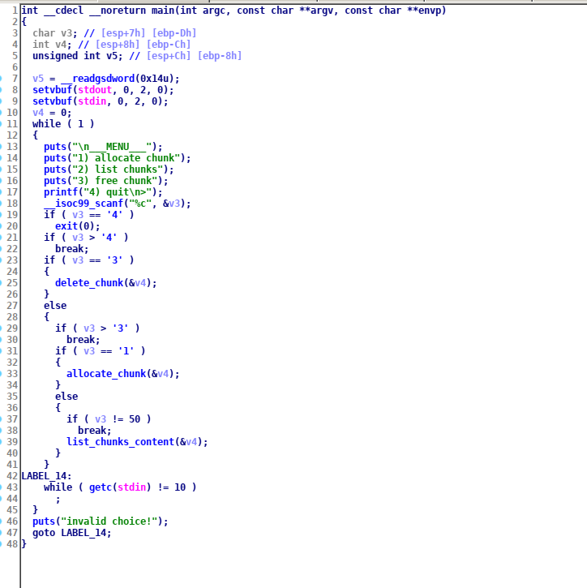
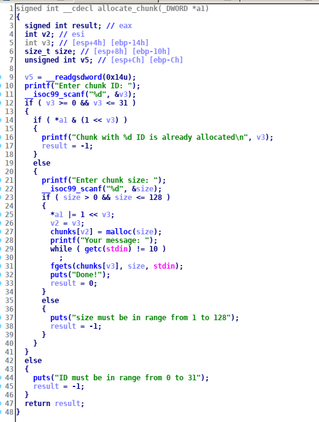

We are given 3 files the binary, zip archive with libc and ld and bash script that runs the binary. 
First let's look at the binary in IDA:

Here is the code that simply reads a character and executes a command appropriate to it. But what v4 variable used for ?
Lets look deep into the function allocate_chunk:

